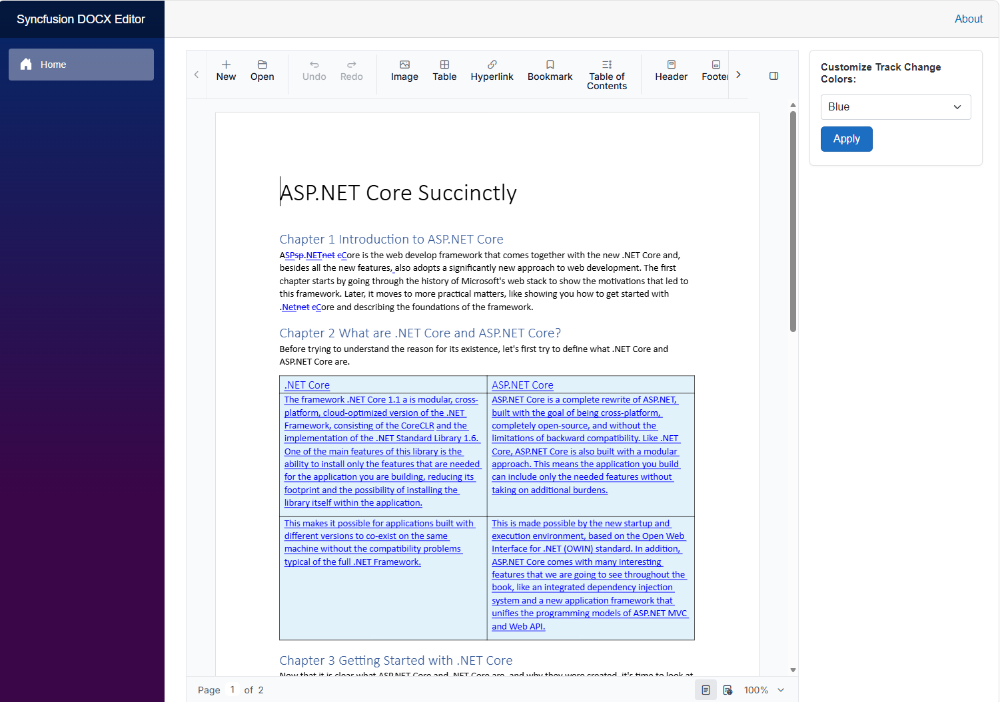

# Customize Track Change Colors in Blazor Document Editor

## Intro

This sample demonstrates how to customize the **track changes color** in the Syncfusion Blazor Document Editor.

The sample displays a Word document containing tracked changes and provides an easy-to-use property panel for selecting different colors. Users can apply a color and immediately see the updated color for revisions in the document.

## Project Features

- Display a Word document with tracked changes.
- Customize the color used to display revisions.
- Choose from multiple predefined colors.
- Apply the selected color directly to the Document Editor.
- Provides an interactive property panel for configuring revision colors.
- Built with **Syncfusion Blazor Document Editor**.
- Uses **Blazor Interactive Server** rendering.

## How to Run the Sample

### Prerequisites

Make sure the following are installed:

- [.NET 10 SDK](https://dotnet.microsoft.com/download/dotnet/10.0)
- [Code Studio](https://www.syncfusion.com/code-studio/), or
- [Visual Studio 2022](https://visualstudio.microsoft.com/) with the **ASP.NET and web development** workload, or
- [Visual Studio Code](https://code.visualstudio.com/)

- A modern web browser

### Run with Visual Studio

1. Clone or download this repository.
2. Open `BlazorWebApp.sln` in Visual Studio.
3. Restore the NuGet packages.
4. Build the solution.
5. Run the application using **F5** or **Debug > Start Debugging**.
6. Open the application in your browser.

### Run with Code Studio (or Visual Studio Code)

1. Clone or download this repository.
2. Open the project folder in Visual Studio Code.
3. Open the integrated terminal.
4. Navigate to the application directory:

```bash
cd BlazorWebApp
```

6. Restore the required packages:

```bash
dotnet restore
```

7. Run the application:

```bash
dotnet run
```

8. Open the HTTPS URL displayed in the terminal.

### Run from the Command Line

```bash
cd BlazorWebApp
dotnet restore
dotnet build
dotnet run
```

Open the HTTPS URL shown in the terminal to launch the sample.

## Demo

The sample opens a document containing tracked changes. Use the **Customize Track Change Colors** panel to change the revision color.



## Resources

- **Product page:**   [Syncfusion® Blazor DOCX Editor](https://www.syncfusion.com/docx-editor-sdk/blazor-docx-editor?utm_source=github&utm_medium=listing&utm_campaign=github-github-documenteditor-examples) 

- **Documentation:**   [Syncfusion® Blazor DOCX Editor - Documentation](https://help.syncfusion.com/document-processing/word/word-processor/blazor/overview?utm_source=github&utm_medium=listing&utm_campaign=github-github-documenteditor-examples) 

- **Online demo:**   [Syncfusion® Blazor DOCX Editor - Online demo](https://document.syncfusion.com/demos/docx-editor/blazor-wasm/document-editor/default-functionalities?utm_source=github&utm_medium=listing&utm_campaign=github-github-documenteditor-examples) 

## Support and feedback 

For any other queries, reach our [Syncfusion® support team](https://support.syncfusion.com/?utm_source=github&utm_medium=listing&utm_campaign=github-github-documenteditor-examples) or post the queries through the [community forums](https://www.syncfusion.com/forums?utm_source=github&utm_medium=listing&utm_campaign=github-github-documenteditor-examples). 

Request new feature through [Syncfusion® feedback portal](https://www.syncfusion.com/feedback?utm_source=github&utm_medium=listing&utm_campaign=github-github-documenteditor-examples). 

## License

This is a commercial product and requires a paid license for possession or use Syncfusion's licensed software, including this component, is subject to the terms and conditions of [Syncfusion's EULA](https://www.syncfusion.com/license/studio/34.1.29/syncfusion_essential_studio_eula.pdf?utm_source=github&utm_medium=listing&utm_campaign=github-github-documenteditor-examples). You can purchase a licnense [here](https://www.syncfusion.com/sales/products?utm_source=github&utm_medium=listing&utm_campaign=github-github-documenteditor-examples) or start a free 30\-day trial [here](https://www.syncfusion.com/account/manage-trials/start-trials?utm_source=github&utm_medium=listing&utm_campaign=github-github-documenteditor-examples). 